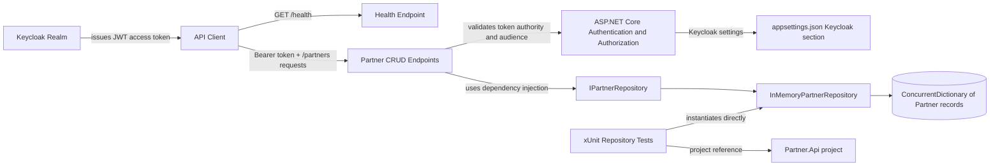
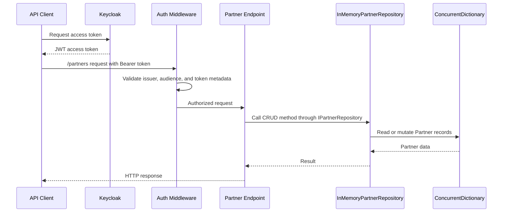

# Component Relationships

This document explains how the projects and runtime components in PartnerAPI relate to each other.

## High-level structure

PartnerAPI is a small .NET solution with two projects:

- `src/Partner.Api` contains the ASP.NET Core minimal API application.
- `tests/Partner.Api.Tests` contains xUnit tests that exercise repository behavior through a project reference to the API project.

At runtime, the API exposes a public health endpoint and protected partner CRUD endpoints. The protected endpoints use JWT bearer authentication configured from the `Keycloak` section in `appsettings.json`.

## Component diagram

## Runtime request flow

## Component responsibilities

| Component | Location | Responsibility |
| --- | --- | --- |
| `Program.cs` application startup | `src/Partner.Api/Program.cs` | Registers services, configures Swagger, authentication, authorization, and maps HTTP endpoints. |
| Partner endpoints | `src/Partner.Api/Program.cs` | Provide CRUD operations under `/partners`; all partner routes require authorization. |
| Health endpoint | `src/Partner.Api/Program.cs` | Provides the public `/health` route for basic availability checks. |
| `KeycloakOptions` | `src/Partner.Api/Program.cs` and `src/Partner.Api/appsettings.json` | Binds Keycloak authority, realm, client/audience, and HTTPS metadata settings for JWT validation. |
| `IPartnerRepository` | `src/Partner.Api/Program.cs` | Defines the persistence contract used by the endpoints. |
| `InMemoryPartnerRepository` | `src/Partner.Api/Program.cs` | Stores partner records in memory, normalizes email values, and supports create, read, update, and delete operations. |
| Repository tests | `tests/Partner.Api.Tests/PartnerRepositoryTests.cs` | Verifies repository behavior such as email normalization and deletion. |

## Dependency direction

- The API project owns the domain records, request records, repository contract, repository implementation, and endpoint mappings.
- Endpoint handlers depend on `IPartnerRepository`, not directly on the concrete repository type.
- Dependency injection maps `IPartnerRepository` to `InMemoryPartnerRepository` as a singleton.
- The test project depends on the API project through a project reference and directly creates `InMemoryPartnerRepository` for unit tests.
- Keycloak is an external identity provider; the API validates tokens but does not issue them.

## Important behavior notes

- Partner records are stored in memory, so data is lost when the API process restarts.
- The repository uses `ConcurrentDictionary<Guid, Partner>` to support thread-safe access within the running process.
- Emails are trimmed and lowercased when partners are created or updated.
- `/health` is public, while `/partners` endpoints require a valid bearer token.
