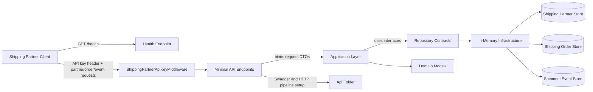
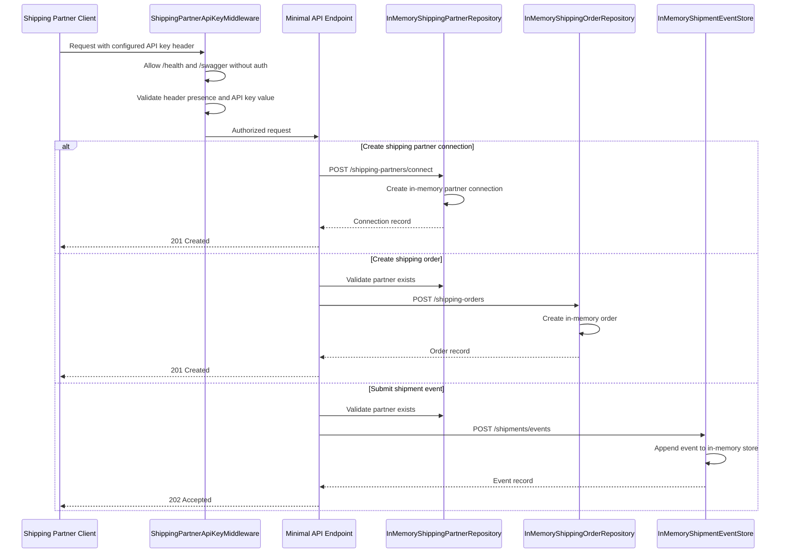

# Shipping Partner Integration Flow

This document explains how `src/Shipping.Partner.Integration` works at runtime and how requests move through the system.

## High-level structure

The shipping partner integration project is a minimal ASP.NET Core API organized with Clean Architecture-style folders:

- `Api` contains middleware and endpoint wiring.
- `Application` contains request contracts and repository interfaces.
- `Domain` contains the core shipping partner, shipment event, and shipping order models.
- `Infrastructure` contains in-memory implementations and API key validation.

The project exposes:

- a public health check
- partner connection endpoints
- shipment event ingestion endpoints
- shipping order creation endpoints

All non-public routes require the shipping partner API key header configured in `appsettings.json`.

## Middleware purpose

[`src/Shipping.Partner.Integration/Api/Middleware/ShippingPartnerApiKeyMiddleware.cs`](/d:/Code/PartnerAPI/src/Shipping.Partner.Integration/Api/Middleware/ShippingPartnerApiKeyMiddleware.cs) is the request gate for the integration API.

Its job is to:

- let `/health` and `/swagger` pass through without authentication
- read the configured API key header name from `ShippingPartnerIntegrationOptions`
- reject requests with a missing key using `401 Unauthorized`
- reject requests with an invalid key using `403 Forbidden`
- forward valid requests to the endpoint pipeline

This middleware keeps partner access control separate from business logic and makes the authorization rule easy to swap later for JWT, mTLS, or a partner-specific auth provider.

## Component diagram

## Runtime request flow

## Endpoint responsibilities

| Endpoint | Purpose |
| --- | --- |
| `GET /health` | Public availability check. |
| `POST /shipping-partners/connect` | Registers a shipping partner connection and generates an API key record. |
| `GET /shipping-partners` | Lists all connected shipping partners. |
| `GET /shipping-partners/{id}` | Returns one connected shipping partner by ID. |
| `POST /shipping-orders` | Creates a shipping order for a known partner. |
| `GET /shipping-orders` | Lists shipping orders, optionally filtered by `partnerId`. |
| `POST /shipments/events` | Accepts shipment lifecycle events for a known partner. |
| `GET /shipments/events` | Lists shipment events, optionally filtered by `partnerId`. |

## Layer responsibilities

| Layer | Location | Responsibility |
| --- | --- | --- |
| `Program.cs` | `src/Shipping.Partner.Integration/Program.cs` | Composition root that wires the application together. |
| `Api` | `src/Shipping.Partner.Integration/Api` | Hosts middleware and endpoint mapping logic. |
| `Api/Middleware/ShippingPartnerApiKeyMiddleware.cs` | `src/Shipping.Partner.Integration/Api/Middleware/ShippingPartnerApiKeyMiddleware.cs` | Validates the shipping partner API key header and blocks unauthorized requests before they reach the endpoints. |
| `Api/Endpoints/ShippingPartnerIntegrationApp.cs` | `src/Shipping.Partner.Integration/Api/Endpoints/ShippingPartnerIntegrationApp.cs` | Maps HTTP routes and coordinates partner, order, and event handlers. |
| `Application` | `src/Shipping.Partner.Integration/Application` | Defines requests, contracts, and configuration options. |
| `Domain` | `src/Shipping.Partner.Integration/Domain` | Holds the core data models for partners, orders, and events. |
| `Infrastructure` | `src/Shipping.Partner.Integration/Infrastructure` | Implements in-memory repositories and API key validation. |

## Important behavior notes

- Partner, order, and event data are stored in memory, so the data is lost when the process restarts.
- The `ShippingPartnerApiKeyMiddleware` protects every route except `/health` and `/swagger`.
- A shipping order can only be created when the referenced partner already exists.
- Shipment events are accepted only for known partners.
- The API is intentionally simple and can be replaced later with persistent storage, a message queue, or webhook delivery.
