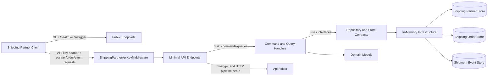
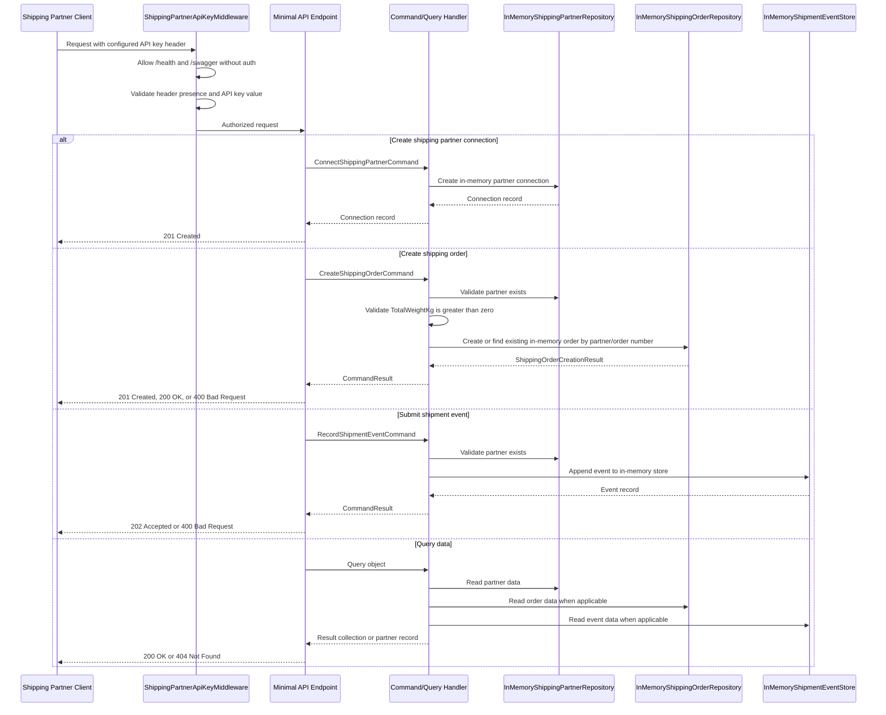

# Shipping Partner Integration Flow

This document explains how `src/Shipping.Partner.Integration` works at runtime and how requests move through the system.

## High-level structure

The shipping partner integration project is a minimal ASP.NET Core API organized with Clean Architecture-style folders:

- `Api` contains middleware and endpoint wiring.
- `Application` contains request contracts, CQRS commands and queries, handlers, repository interfaces, configuration options, and dependency injection registration.
- `Domain` contains the core shipping partner, shipment event, and shipping order models.
- `Infrastructure` contains in-memory implementations and API key validation.

The project exposes:

- a public health check
- partner connection endpoints
- shipment event ingestion and query endpoints
- shipping order creation and query endpoints

All non-public routes require the shipping partner API key header configured in `appsettings.json`.

## Startup and dependency registration

`Program.cs` delegates service registration to `AddShippingPartnerIntegration(...)` and then maps the API through `UseShippingPartnerIntegration()`.

`AddShippingPartnerIntegration(...)` registers:

- endpoint metadata and Swagger generation
- `ShippingPartnerIntegrationOptions` from configuration
- singleton in-memory repositories and event stores
- `ConfigurationApiKeyValidator`
- command handlers for connecting partners, creating orders, and recording shipment events
- query handlers for listing and fetching partners, listing orders, and listing shipment events
- the API key middleware and authorization services

## Middleware purpose

`src/Shipping.Partner.Integration/Api/Middleware/ShippingPartnerApiKeyMiddleware.cs` is the request gate for the integration API.

Its job is to:

- let `/health` and `/swagger` pass through without authentication
- read the configured API key header name from `ShippingPartnerIntegrationOptions`
- reject requests with a missing key using `401 Unauthorized`
- reject requests with an invalid key using `403 Forbidden`
- forward valid requests to the endpoint pipeline

The middleware validates the configured header value through `IApiKeyValidator`. The current `ConfigurationApiKeyValidator` implementation accepts the fixed value `change-me`, while the header name comes from configuration.

This middleware keeps partner access control separate from business logic and makes the authorization rule easy to swap later for JWT, mTLS, or a partner-specific auth provider.

## Component diagram

## Runtime request flow

## Endpoint responsibilities

| Endpoint | Purpose | Handler path |
| --- | --- | --- |
| `GET /health` | Public availability check. | Inline endpoint. |
| `POST /shipping-partners/connect` | Registers a shipping partner connection and generates an API key record. | `ConnectShippingPartnerCommandHandler`. |
| `GET /shipping-partners` | Lists all connected shipping partners. | `GetShippingPartnersQueryHandler`. |
| `GET /shipping-partners/{id}` | Returns one connected shipping partner by ID, or `404 Not Found` when it does not exist. | `GetShippingPartnerByIdQueryHandler`. |
| `POST /shipping-orders` | Creates a shipping order for a known partner, or returns the existing order for a repeat partner/order-number request. | `CreateShippingOrderCommandHandler`. |
| `GET /shipping-orders` | Lists shipping orders, optionally filtered by `partnerId`. | `GetShippingOrdersQueryHandler`. |
| `POST /shipments/events` | Accepts shipment lifecycle events for a known partner. | `RecordShipmentEventCommandHandler`. |
| `GET /shipments/events` | Lists shipment events, optionally filtered by `partnerId`. | `GetShipmentEventsQueryHandler`. |

## Layer responsibilities

| Layer | Location | Responsibility |
| --- | --- | --- |
| `Program.cs` | `src/Shipping.Partner.Integration/Program.cs` | Composition root that wires the application together. |
| `Api` | `src/Shipping.Partner.Integration/Api` | Hosts middleware and endpoint mapping logic. |
| `Api/Middleware/ShippingPartnerApiKeyMiddleware.cs` | `src/Shipping.Partner.Integration/Api/Middleware/ShippingPartnerApiKeyMiddleware.cs` | Validates the shipping partner API key header and blocks unauthorized requests before they reach the endpoints. |
| `Api/Endpoints/ShippingPartnerIntegrationApp.cs` | `src/Shipping.Partner.Integration/Api/Endpoints/ShippingPartnerIntegrationApp.cs` | Maps HTTP routes, builds command/query objects, and converts handler results into HTTP responses. |
| `Application/DependencyInjection` | `src/Shipping.Partner.Integration/Application/DependencyInjection` | Registers options, infrastructure services, middleware, and CQRS handlers. |
| `Application/Cqrs` | `src/Shipping.Partner.Integration/Application/Cqrs` | Defines command/query marker interfaces, handler interfaces, and `CommandResult`. |
| `Application/Commands` | `src/Shipping.Partner.Integration/Application/Commands` | Defines write operations sent from endpoints to command handlers. |
| `Application/Queries` | `src/Shipping.Partner.Integration/Application/Queries` | Defines read operations sent from endpoints to query handlers. |
| `Application/Handlers` | `src/Shipping.Partner.Integration/Application/Handlers` | Implements business flow for commands and queries. |
| `Application/Requests` | `src/Shipping.Partner.Integration/Application/Requests` | Defines HTTP request DTOs that are also passed into repositories/stores for object creation. |
| `Application/Results` | `src/Shipping.Partner.Integration/Application/Results` | Defines application result DTOs, including whether a shipping order was newly created or returned idempotently. |
| `Application/Abstractions` | `src/Shipping.Partner.Integration/Application/Abstractions` | Defines repository, event store, and API key validation contracts. |
| `Domain` | `src/Shipping.Partner.Integration/Domain` | Holds the core data models for partners, orders, and events. |
| `Infrastructure` | `src/Shipping.Partner.Integration/Infrastructure` | Implements in-memory repositories, event storage, and API key validation. |

## Important behavior notes

- Partner, order, and event data are stored in singleton in-memory services, so the data is lost when the process restarts.
- The `ShippingPartnerApiKeyMiddleware` protects every route except `/health` and `/swagger`.
- A shipping order can only be created when the referenced partner already exists.
- `POST /shipping-orders` is idempotent by partner ID and trimmed, case-insensitive order number: the first request creates the order, while repeats return the existing order without changing stored data.
- Shipping order creation fails when `TotalWeightKg` is less than or equal to zero.
- Shipment events are accepted only for known partners.
- Partner names, external references, order fields, tracking numbers, statuses, and locations are trimmed before records are stored.
- Partner lists are returned ordered by partner name; order lists are returned ordered by creation time; shipment events are returned in append order.
- The API is intentionally simple and can be replaced later with persistent storage, a message queue, or webhook delivery.
